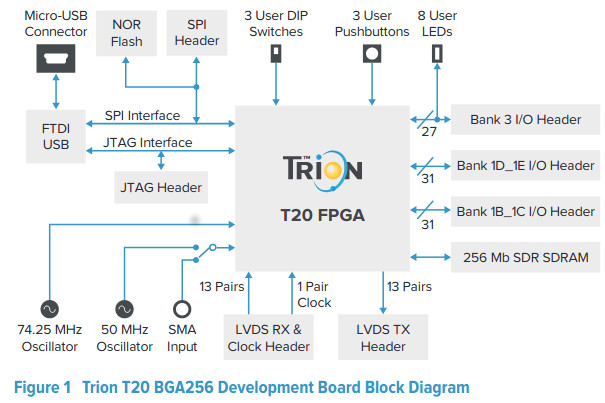
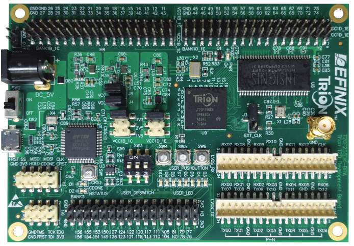

# multi_image
 How to use Efinix FPGA multi_image configuration Demo

 ## Description

> 项目的目的：

通过这个项目， 来快速了解如何使用Efinix FPGA内部的Config selection实现多镜像配置

很多应用到FPGA的产品，在平时运行的时候，我们可以把这个FPGA的基础配置命名为 **Gold Image** ,当Goldimage里面的FPGA接受到一个命令的时候， 是可以跳到其他新更新的FPGA设计上，如果在升级过程中， 系统突然断电， 或者复位， 至少系统还是可以恢复到Gold Image

Efinix的FPGA可以支持4个多镜像的配置，不需要消耗设计资源


This repo focus on introduction Efinix Trion Series FPGA multi_image
- README.md  the project readme file
- Efinix 的官网是 www.efinixinc.com

Efinix FPGA 的第一个低成本FPGA家族是 Trion :
- you can register to access the documentation
- we will provide the EVB and software for your evaluation.
- ...


## Trion FPGA Family

```
  T4,T8 configuation multi_image pin is not inside of chip
  T20~T120, the configuation multi_image pin is inside of chip

- FPGA lower than 30mw
  - T4,T8      : 4K , 8K  pure soft logic fabric product
  - Package    : 5x5mm FBGA81, 55 GPIOs
  - EVB        :
    - T8EVB with build in programmer, you only need PC with USB
    - T20EVB with build in programmer based on FTDI chip, you only need PC with USB
-
```

## Software

On Ubuntu 16LTS : Efinix provide the Free FPGA develop suit, you need register it and buy one piece of EVB

```sh

这个案例基于Efinity 2019.3
```
Other features :

- Efinity 2018.4, we use the Version 2018.4 test the project, you can use Efinity 2019.3 or other advanced version

## Hardware

- The Project is based on Efinix T20F256 EVB, its main features is as follows:

- 这个项目的案例基于T20F256 EVB    
-- The Trion T20 BGA256 development board features:  
-- T20 FPGA  
-- 8 user LEDs  
-- 3 user pushbutton switches, 3 user DIP switches  
-- Micro-USB port  
-- SPI and JTAG headers to facilitate configuration  
-- 3 I/O headers to connect to external devices  
-- 50 and 74.25 MHz oscillators  
-- LVDS TX, RX, and clock headers  
-- 256 Mb SDR SDRAM



### T20F256EVB Product picture




## Project name


- STEP1: install Efinity 2018.4 or other advanced version in Win or Ubuntu
- STEP2: get ready of the T20F256EVB,  
    - if you have same EVB with Efinix engieers, with the other words, it is easy to find the issue with same two boards when you need tech support.

- STEP3: download the total repository directory into Efinity project directory, for examples, C:\Efinity\2019.3\project\multi_image

- STEP4: open the Efinity project of multi_image

- STEP5: download the FPGA design multix4.hex into FPGA, it is all set

- 四个FPGA镜像合成的文件 multix4.hex
- 如何生成的四个镜像合并在文档的pdf文件中详细描述
- multix4.rpt显示了不同的imag的区间和Flash的开始和结束地址

**** Efinity Programming Tool Generation Report *****

Time: 2020-02-01 13:00
Generated Multi Image output file: /home/wisdom/2019.3/project/muti_image/multix4.hex
Device: T20/T13/T8
Image type: external
CBSEL[1:0]  Flash Address  Length      Input Image File
     2'b00  0x00000000     0x000a5afa  /home/wisdom/2019.3/project/muti_image/golden1/outflow/internal_reconfiguration_golden.hex
     2'b01  0x000a6000     0x000a5afa  /home/wisdom/2019.3/project/muti_image/golden2/outflow/internal_reconfiguration_golden.hex
     2'b10  0x0014c000     0x000a5afa  /home/wisdom/2019.3/project/muti_image/golden3/outflow/internal_reconfiguration_golden.hex
     2'b11  0x001f2000     0x000a5afa  /home/wisdom/2019.3/project/muti_image/golden4/outflow/internal_reconfiguration_golden.hex


- 系统每隔7秒左右就会进行一次重新配置下一个image， 周而复始，第四个imag会加载第一个的image

## Documentation

系统中的文档参考了，注册Efinix用户后， 可以下载更加详细的应用指南
在application note目录里有应用解释

- an010-using-internal-reconfiguration-feature-v1.0.pdf（需注册用户）

- an010_T20EVB Setting.pdf  
- Efiniy多镜像原理及用途.pdf  
- receiverimag.jpg  
- T20_multi_reconfig_Ben.pdf  
- T8EVB_multiimage.jpg  
- T8_Multi_image.pdf  

## Project Verilog file list

- internal_reconfiguration_top.v  
- internal_reconfiguration.v  

Project tree

我们放置了四个FPGA的工程
- golden1  
- golden2
- golden3
- golden4

这四个工程的设计基本相同， 只是在**internal_reconfiguration_top.v**中更改**cfg_CBSEL**

## Verilog parameter

- cfg_CBSEL 就是imag选择的管脚

```verilog

//Internal reconfiguration user port
output cfg_ERROR_port;

reg cfg_CONFIG;
reg[23:0] ru_counter;

assign cfg_ERROR_port = cfg_ERROR;
assign cfg_CBSEL = 2'b01;
assign cfg_ENA = 1'b1;

```
## Update

 - Feb-1-2020,  first release to github


## Acknowledge

The code is by Ben Chen
Test by Wisdom Zhang

Project upload by Wisdom Zhang

Anything question: email: 909614802 at qq dot com
